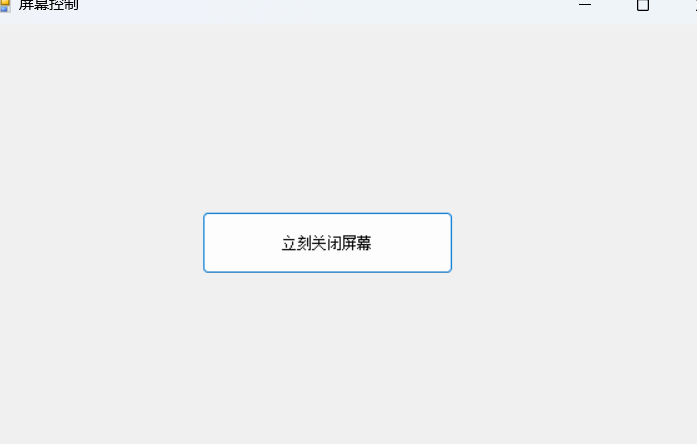

# ScreenControl

## 项目介绍
ScreenControl是一个基于C#/.NET 9.0开发的屏幕控制工具，提供屏幕管理相关功能。

## 功能特点
- 屏幕控制与管理
- 简单易用的用户界面
- 支持Windows操作系统

## 技术栈
- C#
- .NET 9.0
- Windows Forms

## 安装与使用
1. 确保已安装.NET 9.0或更高版本
2. 从发布页下载最新版本
3. 运行ScreenControl.exe即可启动程序

## 项目结构
```
├── MainForm.cs           # 主窗体类
├── MainForm.Designer.cs  # 主窗体设计器
├── Program.cs            # 程序入口
├── Properties/           # 项目属性
└── res/                  # 资源文件
```

## 开发环境
- Visual Studio
- .NET 9.0

## 截图
