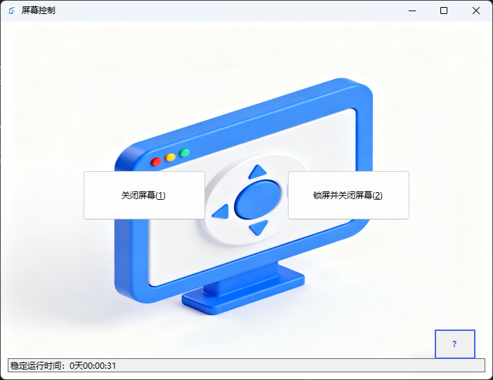

# ScreenControl（屏幕控制）

## 项目介绍

ScreenControl 是一款基于 C# / .NET 10 开发的 Windows 屏幕控制工具，运行于系统托盘，提供屏幕关闭、DPMS 休眠、亮度调节、全局快捷键等屏幕管理功能，并支持自动更新。

当前版本：**v1.7.1**

## 功能特点

- **关闭系统屏保 / 关屏**：一键启动系统屏保（黑屏），支持延迟关闭
- **DPMS 休眠**：让显示器进入低功耗省电状态
- **亮度调节**：通过图形界面调节屏幕亮度
- **全局快捷键**：所有功能均支持全局热键，在任意程序中直接触发
  - 支持 `Ctrl` / `Alt` / `Shift` / `Win` 组合键
  - 数字键自动联动主键盘与小键盘（小键盘键独立注册）
  - 可自由修改，并有冲突检测
- **系统托盘**：最小化到托盘，常驻后台运行
- **鼠标活动监测**：监控系统/鼠标状态并自动更新界面
- **运行时间显示**：显示程序已运行时长
- **操作日志**：记录运行与操作日志（`bugs/screencontrol.log`）
- **设置持久化**：配置保存到 `settings.json`
- **自动更新**：启动时后台检查更新，支持下载与安装

## 默认快捷键

| 功能 | 默认快捷键 |
|---|---|
| 启动系统屏保（关屏） | `Alt+1` |
| DPMS 休眠 | `Alt+2` |
| 亮度调节 | `Alt+3` |
| 帮助菜单 | `Alt+H` |

> 注意：为安全起见，除 `F1`~`F24` 功能键外，全局快捷键必须搭配修饰键（`Ctrl`/`Alt`/`Shift`/`Win`），否则将拒绝注册，避免在任意程序按裸键误触发。

## 技术栈

- C#
- .NET 10.0 (Windows Forms)
- Newtonsoft.Json 13.0.3
- System.Management 10.0.11

## 安装与使用

1. 确保已安装 .NET 10.0 或更高版本
2. 从发布页下载最新版本
3. 运行 `ScreenControl.exe` 即可启动程序，默认驻留系统托盘

## 配置文件

程序根目录下的 `settings.json` 保存用户设置：

- `EnableHotkeys`：是否启用全局快捷键
- `CloseScreenDelay`：关闭屏幕延迟秒数
- `TurnOffScreenKey` / `TurnOffScreenModifier`：启动系统屏保快捷键
- `DpmsKey` / `DpmsModifier`：DPMS 休眠快捷键
- `BrightnessKey` / `BrightnessModifier`：亮度调节快捷键
- `HelpKey` / `HelpModifier`：帮助菜单快捷键

## 项目结构

```
src/
├── MainForm.cs            # 主窗体（托盘、全局热键、关屏/DPMS/亮度逻辑）
├── MainForm.Designer.cs   # 主窗体设计器
├── Program.cs             # 程序入口
├── SettingsForm.cs        # 设置窗体（快捷键配置与冲突检测）
├── BrightnessForm.cs      # 亮度调节窗体
├── AutoUpdateManager.cs   # 自动更新管理
├── UpdateChecker.cs       # 更新检查
├── UpdateDownloader.cs    # 更新下载
├── Properties/            # 项目属性
└── res/                   # 资源文件（图标等）
```

## 开发环境

- Visual Studio
- .NET 10.0

## 相关链接

- Gitee: https://gitee.com/yylmzxc/screen-control
- GitHub: https://github.com/YYLMZXC/screen-control

## 截图


